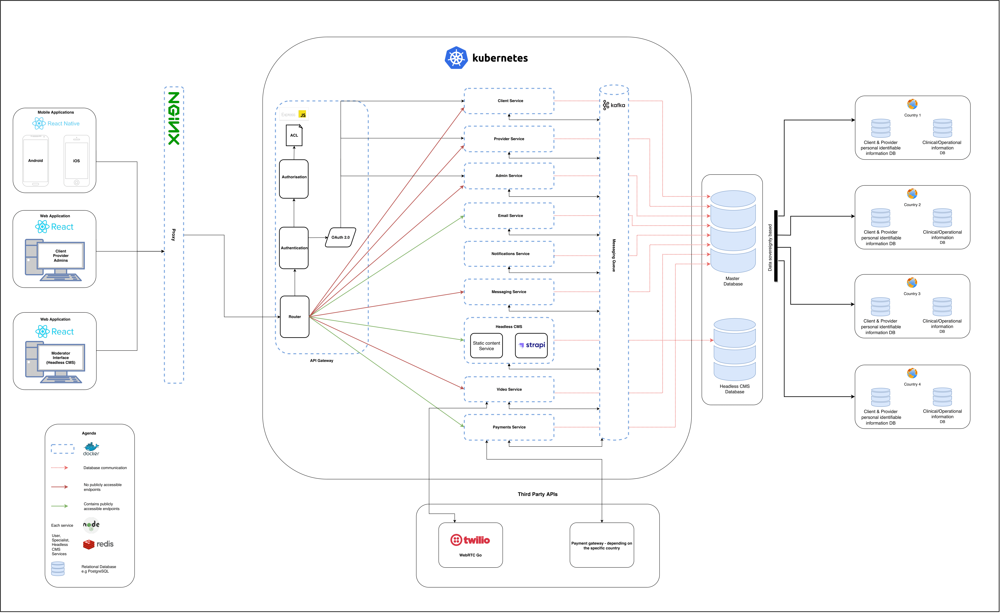
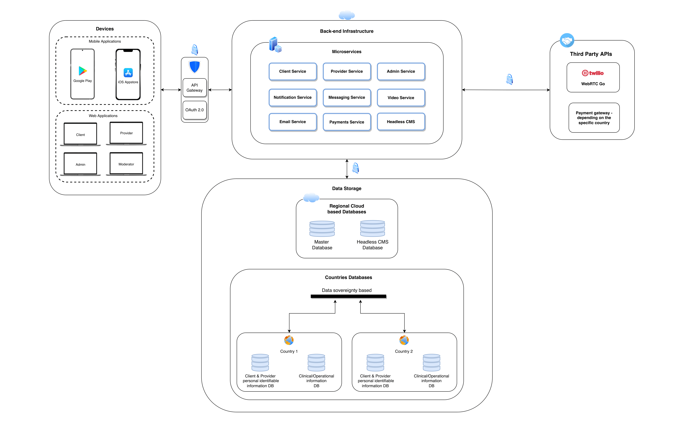

# System Architecture

### Extended Technical Architecture

<figure><figcaption>
Usupport extended technical architecture
</figcaption></figure>

### Simplified Technical Architecture

<figure><figcaption>
Usupport simplified technical architecture
</figcaption></figure>

### Services

Client Service

Provider Service

Admin Service

Email Service

Notifications Service

Messaging Service

Headless CMS

Video Service

Payments Service

###
