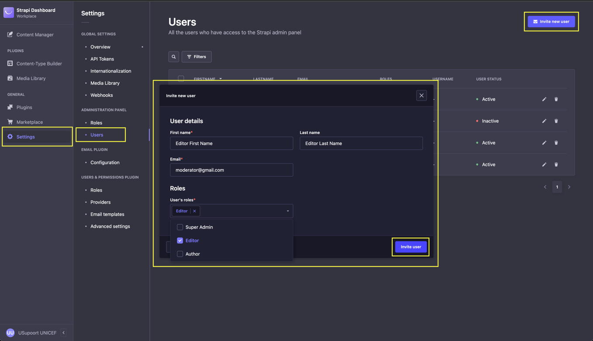

# CMS

### Table of Contents

[Table of Figures](cms.md#table-of-contents)

[List of Tables](cms.md#list-of-tables)

[Introduction](cms.md#introduction)

[What is the CMS?](cms.md#what-is-the-cms)

[User Roles Description](cms.md#user-roles-description)

[1. Moderator](cms.md#1.-moderator)

[2. Editor](cms.md#2.-editor)

[3. Author](cms.md#3.-author)

[Processes](cms.md#processes)

[1. Creating a new user](cms.md#1.-creating-a-new-user)

[2. Editing Users](cms.md#2.-editing-users)

[3. Deleting Users](cms.md#3.-deleting-users)

[4. Login to the CMS Interface](cms.md#_toc123778358)

[5. Forgot Password](cms.md#5.-forgot-password)

[6. Adding new languages](cms.md#6.-adding-new-languages)

[7. Populate Media Library](cms.md#7.-populate-media-library)

[8. Create Collection Types](cms.md#8.-create-collection-types)

[8.1. Age Groups Collection Type](cms.md#8.1.-age-groups-collection-type)

[8.2. Tags Collection Type](cms.md#8.2.-tags-collection-type)

[8.3. Categories Collection Type](cms.md#8.3.-categories-collection-type)

[8.4. Articles Collection Type](cms.md#8.4.-articles-collection-type)

[8.5. Terms of use Collection Type](cms.md#8.5.-terms-of-use-collection-type)

[8.6. Cookie Policies Content Type](cms.md#8.6.-cookie-policies-content-type)

[8.7. FAQs Content Type](cms.md#8.7.-faqs-content-type)

[8.8. SOS Center Content Type](cms.md#8.8.-sos-center-content-type)

[8. Approving content](cms.md#9.-approving-content)

[9. Creating translations for existing content](cms.md#_ref121062657)

### Table of Figures

Figure 1: How to create a new CMS user

Figure 2: How to edit user data in the CMS

Figure 3: How to delete an existing CMS account

Figure 4: Login Screen

Figure 5: Forgot Password Screen

Figure 6: Internalization managing languages

Figure 7: Media Library CMS Interface

Figure 8: Accessing Age Groups Content Type

Figure 9: Creating a new Collection Type

Figure 10: Popup showing that data was successfully saved

Figure 11: Field validation error

Figure 12: Article with tags visualisation

Figure 13: Visual representation of assigning Categories, Age Groups and Tags to an Article before and after

Figure 14: Article in "draft" state ready to be published

Figure 15: Choosing a new locale for an existing article in English version

Figure 16: New Article entry for Kazakh locale

### List of Tables

Table 1: Available Collection Types based on user roles

### Introduction

Dear colleagues,

In the past few months, the team of 7DIGIT has been working on the Content Management System (CMS) as part of the uSupport platform. It serves as a core element, storing all content related to the Information Portal, SOS Centers, Frequently asked questions, Terms of use and Cookie Policies.

We hereby share with you the detailed user manual for the CMS.

### What is the CMS?

The CMS tool is a manually designed software, build on top of the functionality provided by Strapi after custom adaptation based on the needs of the uSupport project.

This platform is aiming to provide an easy-to-use interface for content creators internationally, operating with straightforward and intuitive flows.

### User Roles Description

The CMS provides 3 different user roles: Moderator, Editor and Author. Each of them provides different access rights to the CMS.

###

### 1. Moderator

This is the role, which provides access to all of the functionalities available in the CMS, without any restrictions. Moderators can create, update and delete any existing data with no regard to who created it. Furthermore, they are able to modify the general configuration of the platform, as well as to create, edit or delete all other moderator, editor and author accounts.

### 2. Editor

This role comes with the first level of functionality restrictions. Editors are only able to manage content and have no access to other accounts or configurations within the CMS.

### 3. Author

This role comes with the second level of restrictions. Authors create content, which is afterwards reviewed by an Editor or a Moderator before being published. Just like the Editors, Authors have no access to other accounts and to the configuration of the CMS platform.

### Processes

### 1. Creating a new user

Step 1: Login with a Moderator account.

Step 2: On the “Navigation Menu” select "Settings".

Step 3: In the submenu, under "Administration Panel" select "Users".

Step 4: On the top-right corner, click on "Invite new user".

Step 5: Enter the user data and choose a role (Moderator, Editor or Author).

Step 6: When you are done, press the "Invite User" button.

Step 7: Copy the registration link and share it with the user.

Step 8: The user opens the registration link and gains access to the CMS.

<figure><figcaption>
Figure 1: How to create a new CMS user
</figcaption></figure>

### 2. Editing Users

Step 1: Login with a Moderator account.

Step 2: On the “Navigation Menu” select "Settings".

Step 3: In the submenu, under "Administration Panel" select "Users".

Step 4: Press the “Edit” button on the right side of the screen.

Step 5: Apply changes by clicking the “Save” button in the right corner.

<figure><figcaption>
Figure 2: How to edit user data in the CMS
</figcaption></figure>

Note: Moderators are also able to set a new password for CMS users.

### 3. Deleting Users

Step 1: Login with a Moderator account.

Step 2: On the “Navigation Menu” select "Settings".

Step 3: In the submenu, under "Administration Panel" select "Users".

Step 4: Press the "Trash" button on the right side of the screen.

Step 5: Press “Confirm” to complete the action.

<figure><figcaption>
Figure 3: How to delete an existing CMS account
</figcaption></figure>

### 4. Login to the CMS Interface 

Step 1: Navigate to the CMS Interface ([https://staging.usupport.online/cms/admin/auth/login](https://staging.usupport.online/cms/admin/auth/login) ).

Step 2: Insert valid login credentials email and password (see Figure 4).

<figure><figcaption>
Figure 4: Login Screen
</figcaption></figure>

The user can choose to tick the box labelled “Remember me” if he/she wishes that the log-in session lasts as long as the browser is open.

### 5. Forgot Password

Step 1: Navigate to the CMS Interface ([https://staging.usupport.online/cms/admin/auth/login](https://staging.usupport.online/cms/admin/auth/login) ).

Step 2: Select “Forgot your password” (see Figure 4).

Step 3: Insert a valid email address ( see Figure 5).

Step 4: Check your email address for recovery email.

<figure><figcaption>
Figure 5: Forgot Password Screen
</figcaption></figure>

If a valid and registered email address within the platform was provided, an automated email will be sent to it. The email will contain a temporary valid link that can be used to set a new password. Following this procedure, the user can access the account using the email address and the newly created password.

### 6. Adding new languages

Step 1: Login with a Moderator account.

Step 2: On the “Navigation Menu” select "Settings".

Step 3: In the submenu, under "Global Settings" select "Internationalization".

Step 4: Click “Add new locale" button from the top right .

Step 5: In the Locales dropdown, choose the new locale to be added and enter a "Display name".

Step 6: Click "Save".

<figure><figcaption>
Figure 6: Internalization managing languages
</figcaption></figure>

Note:

- Internationalization requires a default language to be set. At the current stage, the default language of the CMS platform is set to English. It is not recommended to change this setting as soon as the first piece of content has been published. The reason for this is thoroughly described in the section Creating translations for existing content.
- Creating multiple entries of the same language is not permitted.

### 7. Populate Media Library

Step 1: On the “Navigation Menu” select "Media Library".

Step 2: Click the “Add new assets” button on the top right corner.

Step 3: Choose between “Browse files” or “From URL”.

Step 4: Save the new asset by clicking on “Upload x asset/s to the library”.

The Media Library is a part of the CMS platform which allows to securely store different assets, such as images. Once an asset is uploaded to the media library it is stored within the uSupport system and can be used for populating different content types. For example, each article content type requires to have an image attached to it. When creating a new article and having the Media Library populated with all the assets that we might need, we can easily search for an image directly within the Media Library, instead of browsing the computer.

In case the Media library does not contain the asset, we are looking for we can then browse the computer, find what we need and upload it. The benefit in this case is that once an asset is used, it will automatically be stored inside the Media Library for future use cases.

Notes:

- Moderators and Editors have access to the complete CMS Media Library.
- Authors only have access to the Media Library content in their own accounts.
- Media Library entries can be grouped in separate folders
- Media Library data can be deleted. It is strongly advised to do so with high caution, having in mind that the file might be currently in use and linked to one or more existing Collection Type entries.

<figure><figcaption>
Figure 7: Media Library CMS Interface
</figcaption></figure>

### 8. Create Collection Types

The Collection Types are tables of structured data each of which serves a different purpose. For example, the Articles are stored within the “Articles” collection type and each article consists of specific data entries that together are used to present content.

Step 1: Navigate to the CMS Interface and log in with a moderator account.

Step 2: From the Navigation Menu select "Content Manager" (see Figure 8).

Step 3: From the new menu that is presented, under "Collection Types" select the collection for which a new entry should be added (see Figure 8).

Step 4: On the top right corner click “Create new entry” button (see Figure 8).

Step 5: Fulfil the required fields (see Figure 9).

Step 6: On the top right corner click the “Save” button (see Figure 9).

<figure><figcaption>
Figure 8: Accessing Age Groups Content Type
</figcaption></figure>

<figure><figcaption>
Figure 9: Creating a new Collection Type
</figcaption></figure>

There are multiple available content types within the uSupport CMS platform, e.g. Articles, SOS Centers, and FAQs. The user role defines the access rights to the different Collection Types – see Table 1 bellow.

|                 | Moderator | Editor | Author |
| --------------- | --------- | ------ | ------ |
| Age Groups      | ✅        | ✅     | 🛑     |
| Tags            | ✅        | ✅     | ✅     |
| Categories      | ✅        | ✅     | ✅     |
| Articles        | ✅        | ✅     | ✅     |
| FAQs            | ✅        | ✅     | ✅     |
| SOS Center      | ✅        | ✅     | ✅     |
| Terms of Use    | ✅        | ✅     | 🛑     |
| Cookie Policies | ✅        | ✅     | 🛑     |

Table 1: Available Collection Types based on user roles

Note: Entries within collections have specific validation put in place. After the Save button has been pressed the popup presented in the image below should be displayed. This means that your changes were successfully saved in the Database. In case you don't see it after trying to save the changes, most probably it happens because some of the fields that need to be fulfilled do not match the required validation. The fields that do not comply with the validation rules will show a red-coloured text, containing an error message. Check for these errors for all the available fields.

<figure><figcaption>
Figure 10: Popup showing that data was successfully saved
</figcaption></figure>

<figure><figcaption>
Figure 11: Field validation error
</figcaption></figure>

#### 8.1. Age Groups Collection Type

The age groups are meant to separate the Articles into two different sections based on the different ages of the target audience.

Entry Fields:

- Name – Required Field

Relation Entries:

- Articles – Not Required field

Note: the capability to assign articles to an age group was disabled, instead the age groups should be assigned to articles from the article’s creation view.

Creation process:

- The general case described above applies.
- Does not require approval from country administrators.

Usage by other interfaces:

- This is not a collection that is expected to change very often. Adding further content might result in requiring small design adjustments of the following parts of the Usupport platform – Commercial Website Interface and Client Interface.

#### 8.2. Tags Collection Type

The tags represent keywords that are attached to Articles with the purpose of summarising the information, covered within the content. They are defined by specialists following different psychological topics.

Entry Fields:

- Name – Required Field

Relation Entries:

- Articles – Not Required field

Note: the capability to assign articles to a tag was disabled, instead the tags should be assigned to articles from the article’s creation view.

Creation process:

- The general case described above applies.
- Does not require approval from country administrators.

Usage by other interfaces:

- When creating Articles, we will have the option to link multiple tags to one article. Those tags will be displayed within the UI interfaces when presenting the articles, see Figure 12.

<figure><figcaption>
Figure 12: Article with tags visualisation
</figcaption></figure>

#### 8.3. Categories Collection Type

Categories are meant to group articles together based on the information they present related to different psychological topics.

Entry Fields:

- Name – Required Field
- Image – Not Required Field

Relation Entries:

- Articles – Not Required field

Note: the capability to assign articles to a category was disabled, instead the categories should be assigned to articles from the article’s creation view.

Creation process:

- The general case described above applies.
- Does not require approval from country administrators.

Usage by other interfaces:

- When creating Articles, we will see an option to link a category to the new Article entry. This will be used for filtering Articles in the UI interfaces.

<figure><figcaption></figcaption></figure>

<figure><figcaption>
Figure 13: Visual representation of assigning Categories, Age Groups and Tags to an Article before and after
</figcaption></figure>

#### 8.4. Articles Collection Type

They represent informational content with the purpose of raising awareness and providing insights about different psychological topics.

Entry Fields:

- Title – Required Field
- Image – Required Field
- Preview Text (Summary of the article) - Required Field
- Text (The body of the article) – Required Field
- Reading time – Required Field
- Reading Count (The number of views the article received being displayed in uSupport interfaces) – Automatically set to 0 on creation
- Global (Determines if the entry will automatically be displayed in new countries that join the uSupport project) – Required Field

Relation Entries:

- Category (Only one allowed) – Required field
- Age Group (Many allowed) – Required Field
- Tags (Many Allowed) – Required Field

Note: When assigning categories/age groups/tags it is required to make sure that the entries to be assigned are in a “published” state.

Creation process:

- The general case described above applies.
- Requires approval from country administrators.

Usage by other interfaces:

- This collection is directly connected with the uSupport UI interfaces that present the informational portal.
- Every entry which is in a "published" state will be displayed to the general public after country admin approval.

#### 8.5. Terms of use Collection Type

These are the legally binding terms, that the users have to agree with.

Entry Fields:

- Terms of use for the Website (Displayed on the commercial website interface) – Required Field
- Terms of use for the Clients (Displayed on the client’s interface) – Required Field
- Terms of use for the Provider (Displayed on the provider’s interface) – Required Field
- Country (The country to which the terms apply for) – Required Field

Relation Entries:

- There are no relation entries for this collection type

Creation process:

- The general case described above applies.
- Does not require approval from country administrators.

Usage by other interfaces:

- Each entry into the collection will contain content for the three uSupport UI interfaces: Commercial Website Interface, Client Interface and Provider Interface.
- Each entry will be assigned to no more than one country, there should not be 1 country, having two or more entries.
- Every entry which is in a "published" state will be displayed to the general public without country admin approval.

#### 8.6. Cookie Policies Content Type

They provide users with detailed information about the types of cookies the different uSupport interfaces are using.

Entry Fields:

- Cookie Policy for the Website (Displayed on the commercial website interface) – Required Field
- Cookie Policy for the Clients (Displayed on the client’s interface) – Required Field
- Cookie Policy for the Provider (Displayed on the provider’s interface) – Required Field
- Country (The country to which the terms apply for) – Required Field

Relation Entries:

- There are no relation entries for this collection type

Creation process:

- The general case described above applies.
- Does not require approval from country administrators.

Usage by other interfaces:

- Each entry into the collection will contain content for the three Usupport UI interfaces: Commercial Website Interface, Client Interface and Provider Interface.
- Each entry will be assigned to no more than one country, there should not be 1 country, having two or more entries.
- Every entry which is in a "published" state will be displayed to the general public without country admin approval.

#### 8.7. FAQs Content Type

The section Frequently Asked Questions aims to provide relevant information that might be of use to platform users. For instance, those can guide them to perform specific actions, access numerous resources etc.

Entry Fields:

- Question – Required Field
- Answer – Required Field
- Global (Determines if the entry will automatically be displayed in new countries that join the uSupport project) – Required Field

Relation Entries:

- There are no relation entries for this collection type

Creation process:

- The general case described above applies.
- Requires approval from country administrators.

Usage by other interfaces:

- This collection is directly connected with the uSupport UI interfaces.
- Every entry which is in a "published" state will be displayed to the general public after country admin approval.

#### 8.8. SOS Center Content Type

The SOS centre gives quick access to different helplines for users in need of urgent help.

Entry Fields:

- Image – Not Required Field
- Title – Required Field
- Text – Required Field
- Phone – Not Required Field
- URL – Not Required Field
- Global (Determines if the entry will automatically be displayed in new countries that join the uSupport project) – Required Field

Note: Even though the Phone and URL entries are not required fields we strongly recommend including at least one of them.

Relation Entries:

- There are no relation entries for this collection type

Creation process:

- The general case described above applies.
- Requires approval from country administrators.

Usage by other interfaces:

- Every entry which is in a "published" state will be displayed to the general public after the country admin approval.

### 9. Approving content

We have presented what is the content that the CMS tool can operate with, and we have seen how to create this content. Now is the time to present a very important concept that will define the way we can publish this content to go live for the public.

A content entry can be in two states, either “published” or “draft”.

When we create a new piece of content (e.g., Article, Tag, Category etc.) and it is successfully saved the status of that entry is automatically set to “draft”. Once the content is reviewed by either an Editor or a Moderator the content can be transitioned to “published” by clicking one button (see Figure 12).

<figure><figcaption>
Figure 14: Article in "draft" state ready to be published
</figcaption></figure>

At any time, the article can be transitioned back from the “published” state to “draft” by clicking the “Unpublish” button that will be shown instead of the highlighted button in Figure 14.

Note: The Authors can just create content but they don’t have the capability to publish it. Only the moderator and editor roles are allowed to create and publish content without the approval of another users.

### 10. Creating translations for existing content 

We previously presented the internalization capabilities which enable us to store localized versions of the existing content. Moreover, it was mentioned that choosing a default language at the beginning is very important.

Let’s consider the following example. Assume we want to create a new article and the default language is English. The first step will be to create a new entry within the Articles collection type, fulfil the data correctly, and save the changes.

Now we need to create a localized version of the article we just created, for the Kazakh language. The steps for doing this are simple and consist of opening the entry that needs to be translated, in our case the Article we just created. Then from the “Locales” dropdown, we need to select the new language (see Figure 15). It is very important that for every new content we first create the version in the default language, in our case English, and then we create translations of that initial version. This is needed because each translated version is linked to the Initially created one (in the default language).

Figure 15: Choosing a new locale for an existing article in English version

Once we select the new locale we will be prompted to fulfil the translated information. Now we have two options. We can either write the content in the new language and fulfil all the empty fields by hand or we can tell to the CMS to copy the content from other locales and then replace it, see Figure 16.

<figure><figcaption>
Figure 16: New Article entry for Kazakh locale
</figcaption></figure>

Once the data entries for the translated version are completed, we need to click the “Save” button at the top right corner.

The process which we just described will allow content to be displayed in different languages within the uSupport platform.

Notes:

- When creating a new localised version for the Articles Collection Type, we need to assign “Categories”, “Tags” and “Age Groups”. If those do not have translated versions in the language, we are creating a new article entry for, there will not be available categories, tags or age groups to be assigned. The solution to this problem is to create translations for the categories, tags, and age groups before creating the translation for the article.
- Not following the process described above, in regards to the creation of translated versions will result in errors and content not being available within the uSupport platforms.
