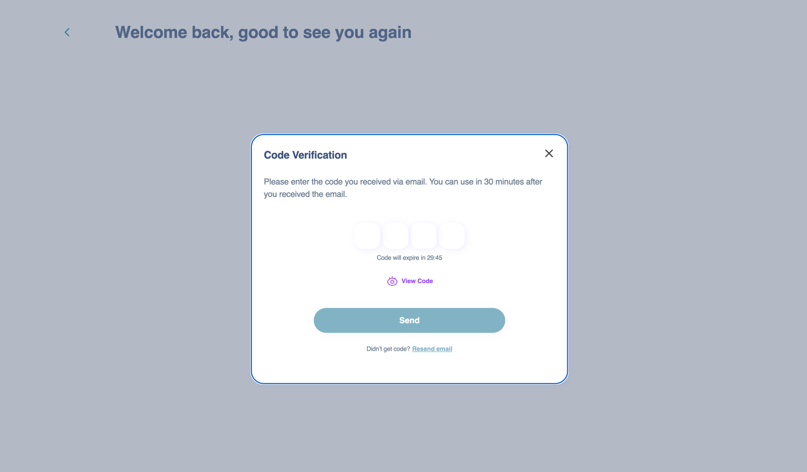
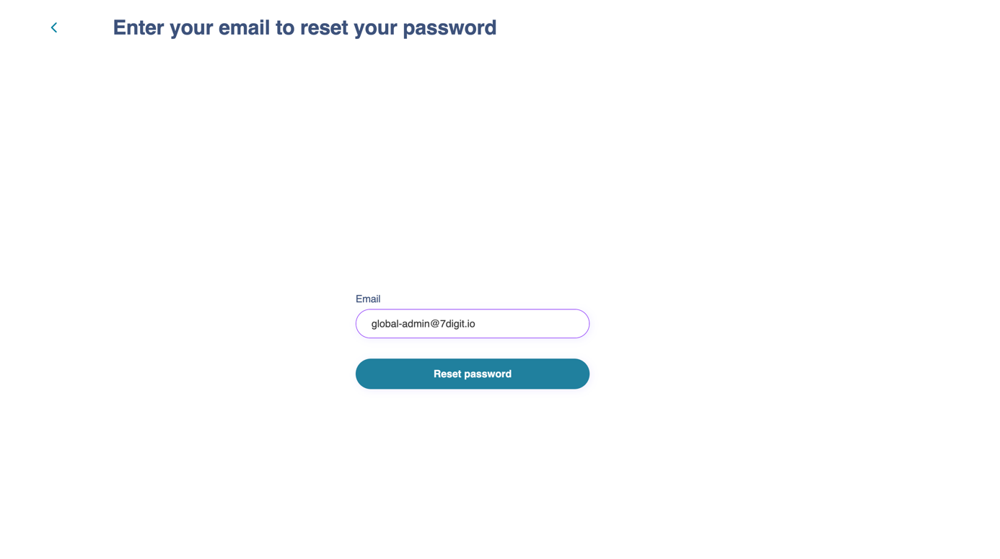
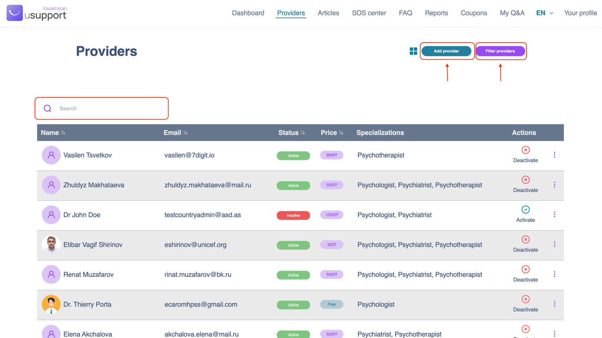
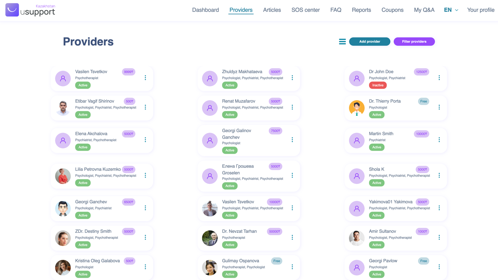
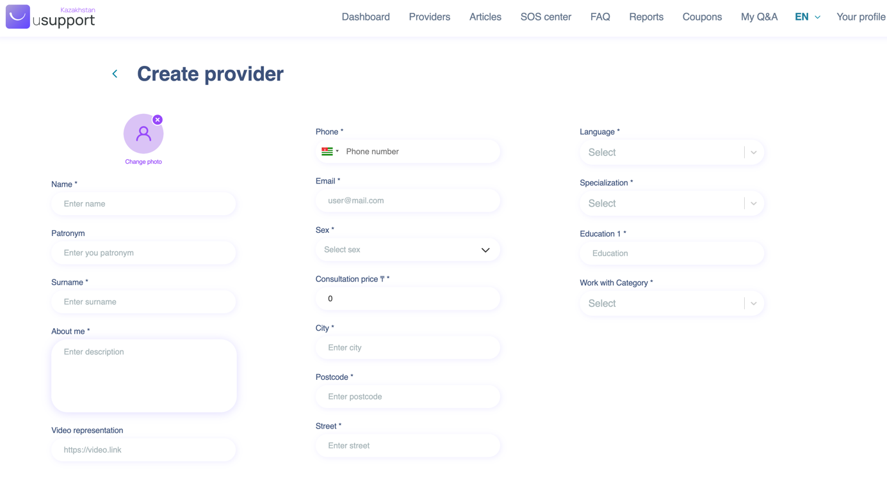
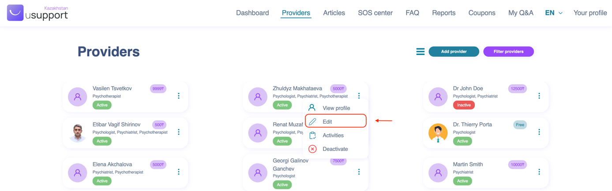

# 🏢 Country Admin

\

Table of Contents

[Table of Figures](country-admin.md#table-of-figures)

[Introduction](country-admin.md#introduction)

[What is the Country Admin Interface?](country-admin.md#what-is-the-country-admin-interface)

[User Roles](country-admin.md#user-roles)

[1.         Country Admin Role](country-admin.md#1.-country-admin-role)

[Processes](country-admin.md#processes)

[1.         Login to the Country Admin Interface](country-admin.md#1.-login-to-the-country-admin-interface)

[2.         Forgot Password](country-admin.md#2.-forgot-password)

[3.         Creating a new provider](country-admin.md#3.-creating-a-new-provider)

[4.         Edit Provider Details](country-admin.md#4.-edit-provider-details)

[5.         Delete Provider](country-admin.md#\_toc130509591)

[6.         Visualise Provider Activity](country-admin.md#6.-visualise-provider-activity)

[7.         Manage Articles](country-admin.md#7.-manage-articles)

[8.         Manage SOS Centers](country-admin.md#8.-manage-sos-centers)

[9.         Manage FAQs](country-admin.md#9.-manage-faqs)

[10.      Creating a sponsor](country-admin.md#\_toc138202339)

[11.      Edit existing Sponsor details](country-admin.md#11.-edit-existing-sponsor-details)

[12.      Creating a campaign](country-admin.md#12.-creating-a-campaign)

[13.      Edit Campaign](country-admin.md#13.-edit-campaign)

[14.      View details about campaign](country-admin.md#14.-view-details-about-campaign)

[15.      View reports](country-admin.md#ole\_link97)

[15.1 Consultation Issues](country-admin.md#15.1-consultation-issues)

[15.2 Information Portal Suggestions](country-admin.md#15.2-information-portal-suggestions)

[15.3 Clients Ratings](country-admin.md#15.3-clients-ratings)

[15.4 Contact Forms](country-admin.md#ole\_link1)

[15.5 My Q\&A Archive](country-admin.md#15.4-my-q-and-a-archive)

[16.      Access My Q\&A](country-admin.md#16.-access-my-q-and-a)

### Table of Figures

Figure 1: Welcome Screen

Figure 2: Login Screen

Figure 3:  One time password verification screen

Figure 4: Forgot Password Screen

Figure 5: Providers Screen table view and list view

Figure 6: Add new Provider Form

Figure 7: Input field validation error

Figure 8: Edit Provider Details

Figure 9: Deactivate existing provide account in list / table view

Figure 10: Deactivate provider profile confirmation.

Figure 11: Visualise Provider Activity

Figure 12: Provider Activity History

Figure 13: Provider activity history firltering options

Figure 14: Articles Screen

Figure 15: SOS centres Screen

Figure 16: FAQs Screen

Figure 17: Campaign sponsor screen

Figure 18: Add new Sponsor form

Figure 19: Edit Sponsor details

Figure 20: Edit Sponsor Details

Figure 21: Sponsors Screen

Figure 22: Sponsor screen add new campaign

Figure 23: Creating new Campaign form

Figure 24: Edit campaign

Figure 25: Edit Campaign Details

Figure 26: Navigate to campaign details

Figure 27: Campaign details screen

Figure 28: Reports visualisation screen

Figure 29: Consultation issue report

Figure 30: Consultation issues filtering options

Figure 31: Information Portal Suggestion report

Figure 32: Information Portal Suggestions filtering options

Figure 33: Client Ratings report

Figure 34: Client Ratings filtering options

Figure 35: Contact form report

Figure 36: Contact Form filtering options

Figure 37: My Q\&A Archive

Figure 38: My Q\&A screen

Figure 39: My Q\&A filtering options.

### Introduction

Dear colleagues,

This guide will present the Country Admin interface which is part of the USupport platform. Its role is highly important as it allows country representatives to manage content and the team of people working to provide psychological support.

### What is the Country Admin Interface?

The Country Admin Interface is a custom-built web-based application for the users that will manage the individual countries within the USupport project.

This platform aims to provide an easy-to-use interface that delivers the necessary capabilities to manage content and providers for a specific country.

### User Roles

The Country Admin interface provides a single-user role.

### 1.   Country Admin Role

This role provides the capabilities of managing the USupport platform on a country level from an administrative perspective. The Country Admins have the capability to perform the following actions:

* preview statistics,
* create and update providers' accounts,
* manage which content to be displayed within the information portal,
* manage which frequently asked questions to be displayed within the Client interface,
* manage which SOS centres to be displayed within the Client interface.
* analyse reports submitted by clients.

### Processes

### 1.   Login to the Country Admin Interface

Step 1:       Navigate to the Global Admin Interface (https://usupport.online/country-admin).

Step 2:       From the Welcome Screen select a country and a language.

Step 3:       Insert valid login credentials.

Step 4:       Insert OTP which was sent to the email address.

<figure><figcaption>
Figure 1: Welcome Screen
</figcaption></figure>

<figure><figcaption>
Figure 2: Login Screen
</figcaption></figure>

<figure><figcaption>
Figure 3: : One time password verification screen
</figcaption></figure>

### 2.   Forgot Password

Step 1:       Select “I forgot my password” (see Figure 2).

Step 2:       Insert a valid email address (see Figure 3)

Step 3:       Check provided email address for recovery email

<figure><figcaption>
Figure 4: Forgot Password Screen
</figcaption></figure>

If a valid and registered email address within the platform was provided, an automated email will be sent to it. The email will contain a temporary valid link that can be used to set a new password. Following this procedure, the user can access the account using the email address and the newly created password.

### 3.   Creating a new provider

Step 1:       Login to the Country Admin Interface.

Step 2:       On the “Navigation Menu” select “Providers”.

Step 3:       Click “Add provider” button.

Step 4:       Fulfil the form with providers’ details.

Step 5:       Click the “Create provider” button to save the new details.

<figure><figcaption></figcaption></figure>

<figure><figcaption>
Figure 5: Providers Screen table view and list view
</figcaption></figure>

<figure><figcaption>
Figure 6: Add new Provider Form
</figcaption></figure>

Note: Some of the input fields are mandatory and have validation in place. In order to create a new provider all the required fields have to be fulfilled. When the validation for one of the fields fails, the error will be shown below the input field, in red text (see Figure 6).

<figure><figcaption>
Figure 7: Input field validation error
</figcaption></figure>

### 4.   Edit Provider Details

Step 1:       Login to the Country Admin Interface.

Step 2:       On the “Navigation Menu” select “Providers”.

Step 3:       Choose a provider and click on the three dots at the top-right corner of the box.

Step 4:       From the dropdown menu select “Edit”.

Step 5:       Update the provider data.

Step 6:       Click on the “Save Changes” button.

<figure><figcaption></figcaption></figure>

<figure><figcaption>
Figure 8: Edit Provider Details
</figcaption></figure>

### 5.   Delete Provider 

Step 1:       Login to the Country Admin Interface.

Step 2:       On the “Navigation Menu” select “Providers”.

Step 3:       Choose a provider and click on the three dots at the top-right corner of the box or click on the “Deactivate” button (based on which view is presented table/list).

Step 4:       From the dropdown menu select “Delete”.

<figure><figcaption></figcaption></figure>

<figure><figcaption>
Figure 9: Deactivate existing provide account in list / table view
</figcaption></figure>

<figure><figcaption>
Figure 10: Deactivate provider profile confirmation.
</figcaption></figure>

Note:  After the provider's account is deactivated, they will lose the ability to make changes to their availability, join campaigns, propose consultations to clients, or show up in client searches. However, it's important to note that the provider will still have access to their account, be able to view their previous consultations, and conduct consultations that have already been scheduled.

### 6.   Visualise Provider Activity

Step 1:       Login to the Country Admin Interface.

Step 2:       On the “Navigation Menu” select “Providers”.

Step 3:       Choose a provider and click on the three dots at the top-right corner of the box.

Step 4:       From the dropdown menu select “Activity”.

<figure><figcaption></figcaption></figure>

<figure><figcaption>
Figure 11: Visualise Provider Activity
</figcaption></figure>

<figure><figcaption>
Figure 12: Provider Activity History
</figcaption></figure>

By reviewing the activity history, the country administrator can access details regarding the consultations performed by the provider. This information includes the client's name, date and time of the consultation, consultation price, and the campaign through which the consultation was booked.

Additionally, the country administrator can export the displayed data in CSV format by clicking the export button and apply filters to the table using the filtering options provided below.

<figure><figcaption>
Figure 13: Provider activity history firltering options
</figcaption></figure>

Filter options:

* &#x20; Start date
* &#x20; End date

### 7.    Manage Articles

Step 1:       Login to the Country Admin Interface.

Step 2:       On the “Navigation Menu” select “Articles”.

Step 3:       From the list of Articles tick the checkbox for the ones that should be displayed in the Information Portal.

<figure><figcaption>
Figure 14: Articles Screen
</figcaption></figure>

In Figure 14 we can see how a country administrator can preview the pool of available articles. Each article presents a summary that includes an image, the title and a description. To see the entire content, the “view” button should be clicked. This action will redirect to a new page that presents the entire information about the selected article.

In addition, the country administrator has the capability to utilize the search bar to locate a particular article and can conveniently arrange the results based on various columns that are available.

Note:

\-       The articles that are available in the country administrator panel are reviewed and approved by the moderators of the USupport CMS platform.

\-       Translations are supported as well. When changing the language, the administrators will be presented with the translated version of the articles. In case some of the articles do not have a translated version for a specific language, then they will not be shown under the selected language.

### 8.   Manage SOS Centers

Step 1:       Login to the Country Admin Interface.

Step 2:       On the “Navigation Menu” select ”SOS centre”.

Step 3:       From the list of SOS centres tick the checkbox for the ones that should be displayed to the clients for the current country.

<figure><figcaption>
Figure 15: SOS centres Screen
</figcaption></figure>

Note:

\-       The SOS centers that are available in the country administrator panel are reviewed and approved by the moderators of the USupport CMS platform.

\-       Translations are supported as well. When changing the language, the administrators will be presented with the translated version of the SOS centers. In case some of them do not have a translated version for a specific language, then they will be excluded from the results under that specific language.

### 9.   Manage FAQs

Step 1:       Login to the Country Admin Interface.

Step 2:       On the “Navigation Menu” select ”FAQ”.

Step 3:       From the tab bar select a user interface.

Step 4:       From the list of FAQs tick the checkbox for the ones that should be displayed for the currently selected interface.

<figure><figcaption>
Figure 16: FAQs Screen
</figcaption></figure>

Frequently asked questions are created using the USupport CMS platform by moderators. The FAQs are presented in three different interfaces: Commercial Website, Client, and Provider, as for each interface, different questions might be more relevant than others. Therefore, the country administrators are able to choose different FAQs for each of the interfaces.

Note:

\-       The FAQs that are available in the country administrator panel are reviewed and approved by the moderators of the USupport CMS platform.

\-       Translations are supported as well. When changing the language, the administrators will be presented with the translated version of the FAQs. In case some of them do not have a translated version for a specific language, then they will be excluded from the results under that specific language.

\-       The search bar provides country administrators with a convenient tool for swiftly locating and managing specific content within this section. This feature enhances user efficiency and ensures a smoother and more effective user experience.

### 10.     Creating a sponsor 

Step 1:       Login to the Country Admin Interface.

Step 2:       On the “Navigation Menu” select “Coupons”.

Step 3:       Click “Add sponsor” button.

Step 4:       Fulfil the form with sponsors’ details.

Step 5:       Click the “Create sponsor” button.

<figure><figcaption>
Figure 17: Campaign sponsor screen
</figcaption></figure>

<figure><figcaption>
Figure 18: Add new Sponsor form
</figcaption></figure>

The following information is required for creating a new sponsor:

* &#x20;Image
* &#x20; Name
* &#x20; Email
* &#x20; Phone number

Note:

\-       Some of the input fields are mandatory and have validation in place. In order to create a new campaign all the required fields have to be fulfilled.

### 11.     Edit existing Sponsor details

Step 1:       Login to the Country Admin Interface.

Step 2:       On the “Navigation Menu” select “Coupons”.

Step 3:       Choose a sponsor and click on the three dots at the end of the row.

Step 4:       From the dropdown menu select “Edit”.

Step 5:       Update the sponsor data.

Step 6:       Click on the “Save Changes” button.

<figure><figcaption>
Figure 19: Edit Sponsor details
</figcaption></figure>

<figure><figcaption>
Figure 20: Edit Sponsor Details
</figcaption></figure>

### 12.     Creating a campaign

Step 1:       Login to the Country Admin Interface.

Step 2:       On the “Navigation Menu” select “Coupons”.

Step 3:       Choose a sponsor and click on the three dots at the top-right corner of the box.

Step 4:       From the dropdown menu select “View”.

Step 5:       Click the “Create campaign” button.

Step 6:       Fulfil the form with campaign details.

Step 7:       Click the “Create campaign” button.

<figure><figcaption>
Figure 21: Sponsors Screen
</figcaption></figure>

<figure><figcaption>
Figure 22: Sponsor screen add new campaign
</figcaption></figure>

<figure><figcaption>
Figure 23: Creating new Campaign form
</figcaption></figure>

The following information is required for creating a new campaign:

* Campaign Name – identifiable name of the campaign
* Coupon code – a code which the users will use to get the benefits
* Total budget – total value of the campaign
* Total coupons – number of coupons available
* Max coupons per user – how many times a single user can use the coupon
* Start date – start date of the campaign
* End date – end date of the campaign
* Terms and conditions – terms of the campaign, which the providers will need to agree with
* Status – status of the campaign

Note:

* Some of the input fields are mandatory and have validation in place. In order to create a new campaign all the required fields have to be fulfilled.
* The total budget and the total number of coupons are information that is required to be fulfilled by the admin user. Based on those the single coupon price is calculated and displayed. This price represents the benefit that the clients will be entitled for when using the coupon code.
* The campaign can be deactivated at any time during the campaign period by switching on or off the status toggle.

### 13.     Edit Campaign

Step 1:       Login to the Country Admin Interface.

Step 2:       On the “Navigation Menu” select “Coupons”.

Step 3:       Choose a sponsor and click on the three dots at the top-right corner of the box.

Step 4:       From the dropdown menu select “View”.

Step 5:       Choose a campaign and click on the three dots at the top-right corner of the box.

Step 6:       Update the sponsor data.

Step 7:       Click on the “Save Changes” button.

<figure><figcaption>
Figure 24: Edit campaign
</figcaption></figure>

<figure><figcaption>
Figure 25: Edit Campaign Details
</figcaption></figure>

### 14.  View details about campaign

Step 1:       Login to the Country Admin Interface.

Step 2:       On the “Navigation Menu” select “Coupons”.

Step 3:       Choose a sponsor and click on the three dots at the top-right corner of the box.

Step 4:       From the dropdown menu select “View”.

Step 5:       Choose a campaign and click on the three dots at the top-right corner of the box.

Step 6:       Select the “Details” option.

<figure><figcaption>
Figure 26: Navigate to campaign details
</figcaption></figure>

<figure><figcaption>
Figure 27: Campaign details screen
</figcaption></figure>

The screen will present a list of the number of times the selected campaign coupon has been utilized (see Figure 27). The list is dynamically updated whenever a client utilizes an active coupon to book a consultation. It presents various details, including the provider's name, client's initials, client's gender, client's birth year, client's place of residence, and the date the coupon was used. By clicking on the header of a specific column, country administrators can easily sort the displayed information according to their preferences.

Additionally, the country administrator can apply filters to the table using the filtering options provided below and can export the displayed data in CSV format by clicking the export button.

Filter options:

* Enrolled provider
* Registered Client
* Client Sex
* Client’s year of birth
* Client’s place of living
* Date when the coupon was used

### 15.     View reports 

Step 1:       Login to the Country Admin Interface.

Step 2:       On the “Navigation Menu” select “Reports”.

Step 3:       From the “Reports Tabs” select one of the report tabs.

<figure><figcaption>
Figure 28: Reports visualisation screen
</figcaption></figure>

Available reports:

#### 15.1 Consultation Issues

&#x20;    The reports in this section desire to highlight to the Country Administrator any issues that might exist from client’s perspective following consultations with providers. Therefore, in case the client does not report any issue after his/her consultation, there will be no report generated for this section.

A report is generated and added by the clients after each consultation following a series of questions for which they need to answer. Once they submit the questionnaire the system will check the answers and will either generate a report or not.

The report consist of a predefined set of questions and the answers which were provided by the client as presented bellow.

<figure><figcaption>
Figure 29: Consultation issue report
</figcaption></figure>

The report consists of:

* Client name
* Provider name
* Consultation date
* The number of issues reported
* The questions and the answers provided by the client

<figure><figcaption>
Figure 30: Consultation issues filtering options
</figcaption></figure>

Filter options:

* Existent provider
* Minimum number of issues
* Starting date
* End date

Note:

* If the answer to a question represents an issue, the text will be displayed with a red color.

#### 15.2 Information Portal Suggestions

The purpose of this report is to inform the country administrator about the topics that are of interest to clients, so that they can tailor the content development process accordingly.

<figure><figcaption>
Figure 31: Information Portal Suggestion report
</figcaption></figure>

The report consists of:

* Email address of the client
* Time and date when the suggestion was made
* Suggestion text as written by the client

<figure><figcaption>
Figure 32: Information Portal Suggestions filtering options
</figcaption></figure>

Filter options:

* Starting date
* End date

#### 15.3 Clients Ratings

The reports presented in this section represent clients' evaluations of the platform itself and are not assessments of the providers or mobile applications.

<figure><figcaption>
Figure 33: Client Ratings report
</figcaption></figure>

The report consists of:

* Email address of the client
* Start rating (from 1 to 5)
* Time and date
* Feedback text as written by the client

<figure><figcaption>
Figure 34: Client Ratings filtering options
</figcaption></figure>

Filter options:

* Minimum number of stars
* Starting date
* End date

#### 15.4 Contact Forms 

The purpose of this report is to outline various inquiries or questions raised by clients that need to be addressed by the country administrators.

<figure><figcaption>
Figure 35: Contact form report
</figcaption></figure>

The report consists of:

* From where it was sent
* Email address of the client
* Subject
* Time and date

<figure><figcaption>
Figure 36: Contact Form filtering options
</figcaption></figure>

Filter options:

* Subject from a predefined list
* Sender
* Sent from
* Start date
* End date

#### 15.4 My Q\&A Archive

This report aims to give country administrators an overview of the inquiries raised by clients and subsequently archived by providers for various reasons.

<figure><figcaption>
Figure 37: My Q&#x26;A Archive
</figcaption></figure>

The report consists of:

* Provider name
* Provider email
* Achieving reason
* Time when it was archived
* Client Question

### 16.  Access My Q\&A

Step 1:       Login to the Country Admin Interface.

Step 2:       On the “Navigation Menu” select “My Q\&A”.

<figure><figcaption>
Figure 38: My Q&#x26;A screen
</figcaption></figure>

This screen showcases all the Q\&A sessions that have taken place within the platform. It provides country administrators with the flexibility to view unanswered questions or those that have been answered by providers, as depicted in Figure 38.

Furthermore, the country administrators have the ability to filter the presented results using the options below or utilize the search function, which will match the results based on the Q\&A entry's title and tags.

<figure><figcaption>
Figure 39: My Q&#x26;A filtering options.
</figcaption></figure>

Filter options:

* Tag
* Provider
* Start date
* End date
