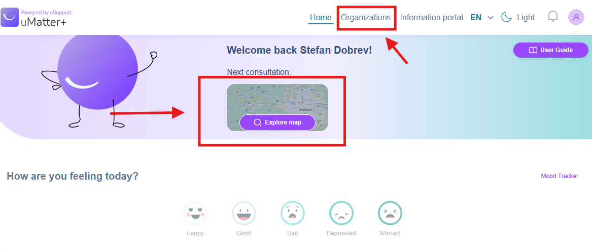

# Romania

### Table of Contents

[Table of Figures](romania.md#table-of-figures)

[1. Key Differences](romania.md#id-1.-key-differences)

[2. New / Country-Specific Features](romania.md#id-2.-new-country-specific-features)

[2.1 Organizations Map](romania.md#id-2.1-organizations-map)

[2.2 Baseline Assessment](romania.md#id-2.2-baseline-assessment)

[2.3 Decision Tree (User Guide)](romania.md#id-2.3-decision-tree-user-guide)

[3. Operational Responsibilities](romania.md#id-3.-operational-responsibilities)

[3.1 Country Admin](romania.md#id-3.1-country-admin)

[3.2 CMS](romania.md#id-3.2-cms)

### Table of Figures

Figure 1: Organizations access from home dashboard

Figure 2: Organizations displayed on the map

Figure 3: Organizations map filters

Figure 4: Organizations cards

Figure 5: Organization contact/directions modal

Figure 6: Baseline assessment

Figure 7: Baseline assessment questionnaire view

Figure 8: Recommendations generated based on the score obtained

Figure 9: Recommendations organizations filter

Figure 10: User guide

Figure 11: User guide available options

Figure 12: Organizations in Country Admin&#x20;

Figure 13: Baseline assessment thresholds

Figure 14: Baseline assessment recommendation content editor

### 1. Key Differences

The Romania implementation differs from the default platform model by removing direct provider-based interactions and introducing a guided support flow.

Instead of browsing and booking providers, users complete a Baseline Assessment, which evaluates their psychological, social, and biological state. Based on the results, users are directed to relevant support services through the Organizations Map, where filters are automatically applied.

Additionally, a Decision Tree (User Guide) is available from the home screen to help users quickly access emergency services, discover relevant organizations, or receive informational guidance.

These changes shift the platform from a provider-centric model to a guided, needs-based support experience.

### 2. New / Country-Specific Features

The following features are specific to the Romania implementation and define its guided support experience.

#### 2.1 Organizations Map

The Organizations Map is the primary feature for discovering support services in Romania. It allows users to explore available organizations such as clinics, therapists, and counselors based on their needs and location.

The map can be accessed directly from the Home dashboard (see Figure 1) or through guided flows such as the Baseline Assessment and Decision Tree, where filters may be automatically applied.

<figure><figcaption>
Figure 1: Organizations access from home dashboard
</figcaption></figure>

The map provides a geographical overview of all available support organizations. Each organization is represented by a pin placed at its physical location.

Users can navigate the map (see Figure 2) by zooming and panning to explore different areas. Pins may appear clustered in regions with a high number of organizations, improving readability and navigation.

Selecting a pin highlights the corresponding organization and provides a quick entry point to view more detailed information about the selected service.

<figure><figcaption>
Figure 2: Organizations displayed on the map
</figcaption></figure>

Users can refine the displayed organizations using the available search and filtering options located above the map.

The search field allows users to quickly find a specific organization by name.

Additional filters enable more precise results:

* Sector - filters organizations by service category or area of support
* Payment methods - allows users to select preferred payment options (e.g. free, paid, CNAS reimburse, co-payment)
* Interaction modes - defines how services are delivered (e.g. in-person, online)
* Property types - specifies the type of organization or facility
* Offered services - filters based on the specific services provided

Filters can be applied individually or in combination to narrow down results.

In guided flows, such as the Baseline Assessment or Decision Tree, filters may be automatically prefilled based on user needs, helping surface the most relevant organizations.

<figure><figcaption>
Figure 3: Organizations map filters
</figcaption></figure>

Below the map, organizations are displayed in a card-based list format, providing a structured overview of available support services.

Each organization card includes key information such as:

* Organization name
* Types of services offered
* Short description of support areas
* Location details (address)

This layout allows users to quickly scan and compare multiple organizations without interacting directly with the map.

Selecting a card provides access to more detailed information about the organization.

<figure><figcaption>
Figure 4: Organizations cards
</figcaption></figure>

Selecting an organization from the map or the list opens a detailed information (see Figure 5) panel directly on the map.

This panel provides key details about the selected organization, including:

* Organization name and description
* Types of services offered
* Contact information (phone and email)
* Address and location

Users can take further actions such as:

* Viewing additional details via the “Read more” option
* Opening the location in external navigation tools (e.g. Google Maps, Waze)

This allows users to quickly access relevant information and decide on the most appropriate support service.

<figure><figcaption>
Figure 5: Organization contact/directions modal
</figcaption></figure>

#### 2.2 Baseline Assessment

The Baseline Assessment is a guided questionnaire designed to evaluate the user’s current psychological, social, and biological state.

It serves as the primary entry point for personalized support by identifying user needs and directing them to relevant services available through the Organizations Map.

The assessment can be retaken at any time. The system always displays the most recent results, and when retaken, it highlights changes in the user’s condition, indicating whether there has been improvement or increased need for support.

<figure><figcaption>
Figure 6: Baseline assessment
</figcaption></figure>

The assessment consists of 26 questions covering three key dimensions:

* Psychological
* Social
* Biological

Each question contributes to an overall evaluation of the user’s current condition.

<figure><figcaption>
Figure 7: Baseline assessment questionnaire view
</figcaption></figure>

Upon completion, the system generates a summarized assessment based on the user's responses.

Results are categorized into three levels:

* Low - indicates a stable condition
* Moderate - suggests areas that may require attention
* High - indicates a need for immediate support

In addition to the scoring, users receive a personalized assessment text providing context and guidance.

<figure><figcaption>
Figure 8: Recommendations generated based on the score obtained
</figcaption></figure>

After viewing the results, users are guided to the Organizations Map, where relevant filters are automatically applied based on the assessment outcome.

This ensures that the displayed organizations match the user’s specific needs, reducing the effort required to find appropriate support.

<figure><figcaption>
Figure 9: Recommendations organizations filter
</figcaption></figure>

The Baseline Assessment replaces the traditional provider selection flow by introducing a needs-based approach.

Instead of directly searching for services, users are first assessed and then guided toward the most relevant support options.

#### 2.3 Decision Tree (User Guide)

The Decision Tree, accessible through the “User Guide” button on the Home dashboard (see Figure 10), provides a guided way for users to quickly navigate available support options.

It is designed to assist users who may not be sure where to start by offering structured paths based on their immediate needs.

<figure><figcaption>
Figure 10: User guide
</figcaption></figure>

Upon opening, the Decision Tree presents three main options:

* Emergency Services - directs users to the SOS Center for immediate assistance
* Find Support Services - allows users to apply filters and explore relevant organizations through the Organizations Map
* Informational Guidance - provides a short questionnaire that delivers helpful content based on user responses

<figure><figcaption>
Figure 11: User guide available options
</figcaption></figure>

The Decision Tree complements the Baseline Assessment by offering a quicker, alternative way to access support.

Depending on the selected option, users are either redirected to emergency services, guided to filtered results in the Organizations Map, or provided with relevant informational content.

### 3. Operational Responsibilities

Operational Responsibilities define the roles involved in managing and maintaining the Romania-specific implementation of the platform.

This includes ensuring that organizations are properly configured and available, as well as managing the content and logic behind the Baseline Assessment and related guidance.

These responsibilities are handled through the Country Admin interface and the CMS.

### 3.1 Country Admin

Country Admins are responsible for managing organizations and configuring assessment-related parameters specific to Romania.

These responsibilities ensure that users are presented with accurate support services and that assessment results are properly calibrated.

Country Admins can add, edit, and manage organizations that are displayed in the Organizations Map.

Each organization includes key information such as:

* Name and description
* Contact details (phone, email, website)
* Address and location
* Sector and service categorization
* Payment methods and interaction modes
* Offered services

Proper configuration of this data ensures that organizations are correctly filtered and recommended to users.

<figure><figcaption>
Figure 12: Organizations in Country Admin 
</figcaption></figure>

Country Admins can configure threshold values for the Baseline Assessment dimensions (psychological, social, and biological).

These thresholds define how user responses are categorized into:

* Low
* Moderate
* High

By adjusting the threshold values, administrators can fine-tune how user needs are evaluated and how results are interpreted within the platform.

<figure><figcaption>
Figure 13: Baseline assessment thresholds
</figcaption></figure>

### 3.2 CMS

The CMS is used to manage content related to the Romania-specific implementation, including Baseline Assessment results and associated recommendations, as well as general content such as articles, podcasts, and videos.

It allows administrators to define the messages and resources presented to users based on their assessment outcomes and broader informational needs.

<figure><figcaption>
Figure 14: Baseline assessment recommendation content editor
</figcaption></figure>

Within the CMS, administrators can configure recommendation entries for the Baseline Assessment.

Each entry is associated with specific result combinations across the psychological, social, and biological dimensions (e.g. low, moderate, high).

This enables the system to deliver tailored guidance based on the user’s assessment results.

