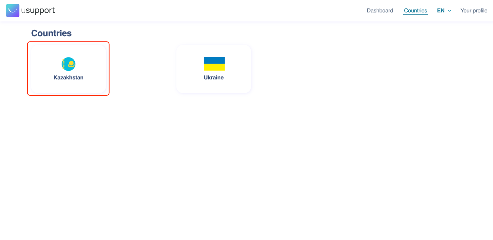
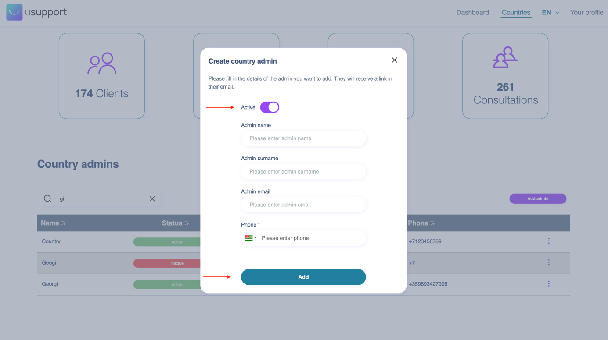

# 🌎 Global Admin

### Table of Contents

[Table of Figures](global-admin.md#table-of-figures)

[Introduction](global-admin.md#introduction)

[What is the Global Admin Interface?](global-admin.md#ole\_link10)

[User Roles](global-admin.md#user-roles)

[1.     Global Admin Role](global-admin.md#1.-global-admin-role)

[Processes](global-admin.md#processes)

[1.     Login to the Global Admin Interface](global-admin.md#1.-login-to-the-global-admin-interface)

[2.     Forgot Password](global-admin.md#2.-forgot-password)

[3.     Creating a new global admin](global-admin.md#3.-creating-a-new-global-admin)

[4.     Visualise country-specific statistics](global-admin.md#4.-visualise-country-specific-statistics)

[5.     Edit country administrator account](global-admin.md#5.-edit-country-administrator-account)

### Table of Figures

Figure 1: Welcome Screen

Figure 2: Login Screen

Figure 3: One time password verification screen

Figure 4: Forgot Password Screen

Figure 5: Dashboard Global Admins screen

Figure 6: New Global Admin Form

Figure 7: USupport Active Countries

Figure 8: Selected Country Information View

Figure 9: Edit Country Admin account

### Introduction

Dear colleagues,

This guide will present the Global Admin interface, which is part of the USupport platform. Its role is highly important as it is a core element that will manage important aspects of the entire infrastructure and will provide metrics to the UNICEF team.

### What is the Global Admin Interface? 

The Global Admin Interface is a custom-built web-based interface for the users that will manage the USupport platform. It provides access granting and monitoring capabilities to the administrative team.

### User Roles

The Global Admin interface has a single role.

### 1.   Global Admin Role

This role provides the capabilities of managing the entire USupport platform from an administrative perspective. The Global admins have the power to create and update global or country-based administrator accounts and visualise important statistics about the state of the platform. Information such as the number of active clients, number of consultations and existent administrators is available.

### Processes

### 1.   Login to the Global Admin Interface

Step 1:       Navigate to the Global Admin Interface (https://usupport.online/global-admin/).

Step 2:       From the Welcome Screen select a language.

Step 3:       Insert valid login credentials.

Step 4:       Insert OTP which was sent to the email address.

<figure><figcaption>
Figure 1: Welcome Screen
</figcaption></figure>

<figure><figcaption>
Figure 2: Login Screen
</figcaption></figure>

<figure><figcaption>
Figure 3: One time password verification screen
</figcaption></figure>

### 2.   Forgot Password

Step 1:       Select “I forgot my password”.

Step 2:       Insert a valid email address (see Figure 3).

Step 3:       Check provided email address for access recovery email.

<figure><figcaption>
Figure 4: Forgot Password Screen
</figcaption></figure>

If a valid and registered email address within the platform was provided, an automated email will be sent to it. The email will contain a temporary valid link that can be used to set a new password. Following this procedure, the user can access the account using the email address and the newly created password.

### 3.   Creating a new global admin

Step 1:       Login to the Global Admin Interface.

Step 2:       On the “Navigation Menu” select “Dashboard”.

Step 3:       Scroll to “Global admins” section and press “Add admin” button.

Step 4:       Fulfil the new global admin form (see Figure 5).

Step 5:       Create a new global admin by pressing the “Add” button.

<figure><figcaption>
Figure 5: Dashboard Global Admins screen
</figcaption></figure>

<figure><figcaption>
Figure 6: New Global Admin Form
</figcaption></figure>

### 4.   Visualise country-specific statistics

Step 1:       Login to the Global Admin Interface

Step 2:       On the navigation menu select “Countries”

Step 3:       From the list of countries, select one (see Figure 6)

<figure><figcaption>
Figure 7: USupport Active Countries
</figcaption></figure>

<figure><figcaption>
Figure 8: Selected Country Information View
</figcaption></figure>

For each country available in the USupport platform the following statistics will be available, as presented in Figure 7.

* &#x20;number of active users,
* &#x20;number of providers,
* &#x20;number of approved articles,
* &#x20;number of conducted consultations.

Furthermore, each country will have one or more country administrators that can be managed from the Global Admin Interface. From the above-presented interface, Global Admins can create new Country Admins accounts by selecting the “Add admin” button. The process of adding a new Country Admin is similar to the one presented in Creating a new global admin section. As we can see in Figure 4, the list of Country Administrators provides meaningful information about individuals. The name, the status of their account, and contact details (email or phone) are displayed.

The status of the account can have two values, namely “active” or “disabled”. The “active” state means that the country admin can access the Country Administrator Interface and manage the specific country. On the other hand, the “disabled” state restricts access to the account, so that it still exists but the user cannot use it. This mechanism allows the Global Admins to control access to the USupport platform on a country level.

In addition to the above-mentioned features, the Global Admin Interface also allows for targeted searches for country administrators by their specific names. Additionally, the search results can be sorted based on each column, enabling the global administrator to easily organize and manage the administrators as needed.

### 5.    Edit country administrator account

Step 1:       Login to the Global Admin Interface.

Step 2:       On the “Navigation Menu” select “Dashboard”.

Step 3:       Scroll to “Country admins” section and identify the account that has to be updated.

Step 4:       Open the drop-down menu by clicking the three dots icon at the end of the row (see Figure 5).

Step 5:       Select the “Edit button” and alter the account information accordingly (see Figure 8).

Step 6:       Once the changes are in place select the “Save changes” button.

<figure><figcaption>
Figure 9: Edit Country Admin account
</figcaption></figure>

The Global admin is able to alter the following information for a country administrator account:

* &#x20;state of the account - enabled or disabled,
* &#x20;name and surname,
* &#x20;email address,
* &#x20;phone number.
